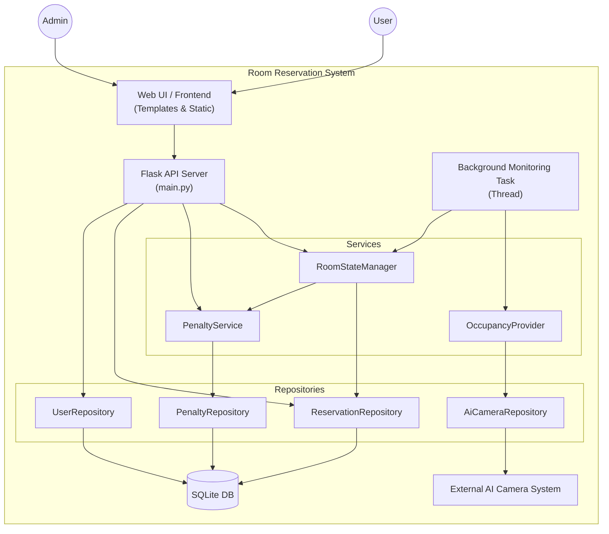
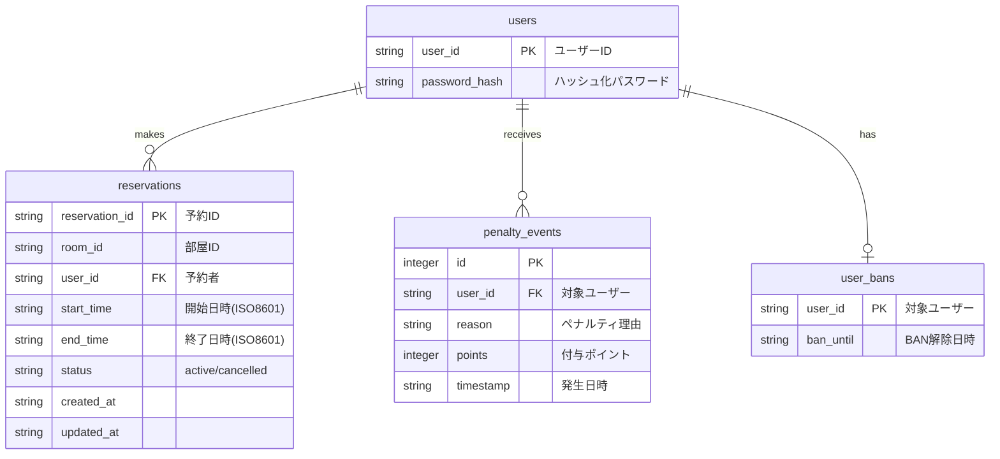
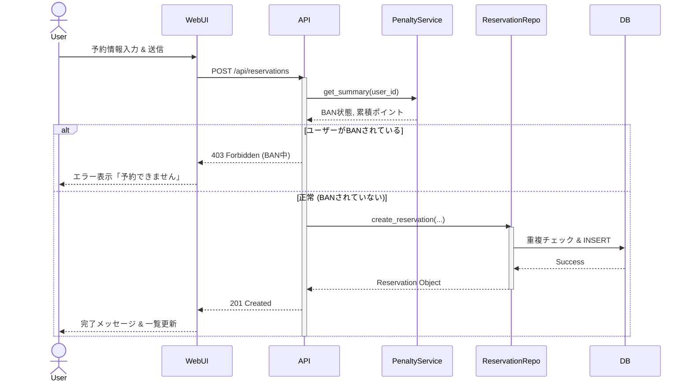
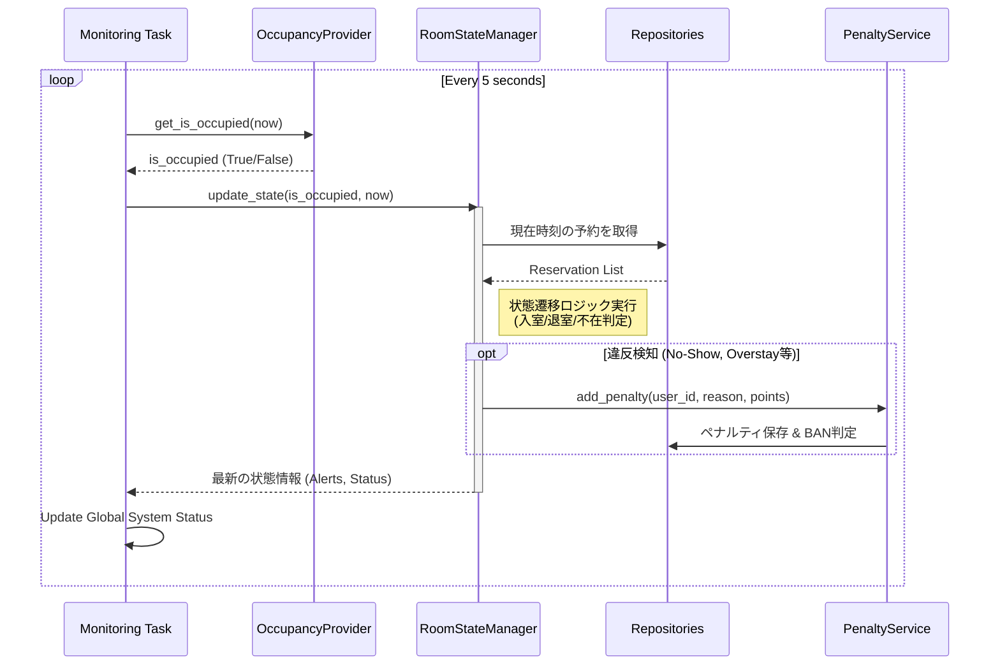

# Room Reservation System

会議室予約および利用状況監視システムです。Webインターフェースからの予約管理と、カメラ（またはダミーデータ）による入退室検知を組み合わせ、不正利用（無断キャンセル、時間超過など）に対するペナルティ管理機能を提供します。

## クイックスタート

### ローカル実行

```bash
$ python main.py
```

### Docker実行

```bash
# バックグラウンドで実行
docker-compose up -d --build
```

### アクセス

アプリケーションは `http://localhost:8000` でアクセス可能です。

## ドキュメント

- [UI 操作ガイド（日本語）](ui_guide_ja.md)

## 環境変数

`.env` ファイル等で以下の設定が可能です。

- `CONSOLE_ENDPOINT`: AIカメラコンソールエンドポイントのURL
- `AUTH_ENDPOINT`: 認証エンドポイントのURL
- `CLIENT_ID`: クライアントID
- `CLIENT_SECRET`: クライアントシークレット
- `DEVICE_ID`: デバイスID
- `OCCUPANCY_MODE`: `camera` (実機) または `dummy` (シミュレーション)
- `USE_SQLITE`: `true` で永続化有効 (デフォルト: false)

---

## アーキテクチャ

本システムは、FlaskベースのWebアプリケーションと、バックグラウンドで動作する監視タスクから構成されています。
Repositoryパターンを採用しており、データアクセス層（インメモリ/SQLite）とビジネスロジックが分離されています。



### 主要コンポーネント

1.  **Web Application (`main.py`)**
    *   ユーザー向けの画面提供 (`/`, `/app/ui`)
    *   予約管理、状態取得のためのREST API (`/api/*`)
    *   デバッグ用インターフェース

2.  **Background Monitoring Task**
    *   5秒間隔で部屋の占有状態をポーリング
    *   予約情報と実際の占有状態を比較し、状態遷移（空室→利用中など）を管理
    *   違反（無断キャンセル、時間超過、未予約利用）検知時にペナルティを発行

3.  **Repositories**
    *   データの永続化を担当。開発用(`InMemory`)と本番用(`Sqlite`)の実装が存在。

## データ構造 (E-R図)

システムの主要なデータモデルです。SQLiteデータベース `data/room_reservation.db` に保存されます。



## シーケンス図

### 1. 予約作成フロー

ユーザーが予約を行う際の処理フローです。ペナルティによるBAN状態のチェックが行われます。



### 2. 監視・状態管理フロー

バックグラウンドで常時実行され、予約と実際の利用状況の整合性をチェックします。



## エコシステム

- **Backend**: Python (Flask)
- **Database**: SQLite3 (プロダクション想定), In-Memory (開発用)
- **AI Integration**: 外部のAIカメラAPIと連携し、人数カウントデータを取得 (`OccupancyProvider`)
- **Container**: Docker, Docker Compose
